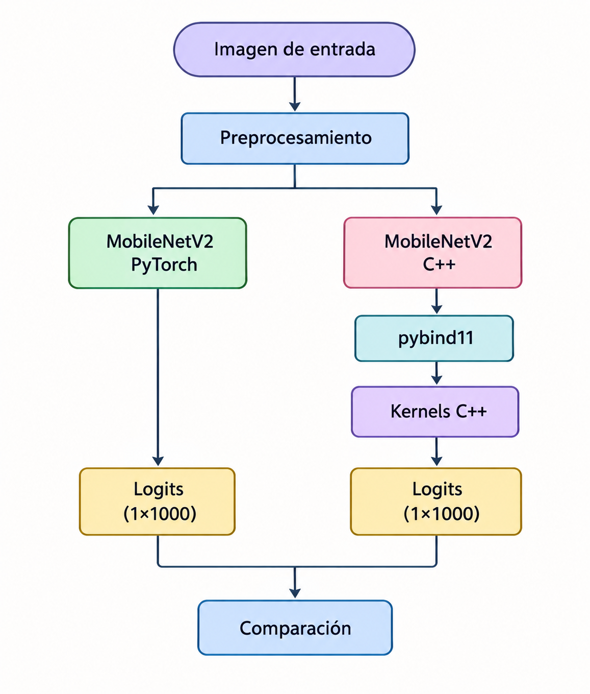

# MobileNetV2 — PyTorch vs C++

Implementación de **MobileNetV2** utilizando capas desarrolladas en **C++** e integradas con Python mediante **pybind11**.

El proyecto utiliza la implementación de MobileNetV2 de **PyTorch** como referencia y permite comparar la inferencia realizada por PyTorch con una implementación basada en kernels C++. Además, el prototipo permite utilizar tanto imágenes almacenadas como imágenes capturadas directamente desde una cámara mediante **C++ y OpenCV**.

## Objetivo

Implementar las principales operaciones utilizadas por MobileNetV2 en C++ y comprobar su funcionamiento comparando la salida del modelo con la implementación de referencia en PyTorch.

Actualmente se implementan las siguientes operaciones:

- Conv2D
- Depthwise Conv2D
- Pointwise Conv2D
- BatchNorm2D
- ReLU6
- Layer Add
- Global Average Pooling
- Linear

Los parámetros del modelo de referencia se cargan en la implementación C++ para realizar la comparación bajo las mismas condiciones.

El prototipo también permite adquirir una imagen desde una cámara, procesarla y utilizarla directamente como entrada de MobileNetV2.

## Estructura del proyecto

```text
MobileNetV2/
├── app/
│   └── run_cpp_mobilenetv2.py
│
├── bindings/
│   ├── pybind_module.cpp
│   └── camera_capture.cpp
│
├── kernels/
│   ├── BatchNorm2d.cpp
│   ├── BatchNorm2d.hpp
│   ├── Conv2d.cpp
│   ├── Conv2d.hpp
│   ├── Depthwise_Conv2d.cpp
│   ├── Depthwise_Conv2d.hpp
│   ├── GlobalAvgPool2d.cpp
│   ├── GlobalAvgPool2d.hpp
│   ├── LayerAdd.cpp
│   ├── LayerAdd.hpp
│   ├── Linear.cpp
│   ├── Linear.hpp
│   ├── Pointwise_Conv2d.cpp
│   ├── Pointwise_Conv2d.hpp
│   ├── ReLU6.cpp
│   └── ReLU6.hpp
│
├── models/
│   ├── CppMobileNetV2.py
│   ├── ManualMobileNetV2.py
│   └── MobileNetV2.py
│
├── wrappers/
│   ├── BatchNorm2d.py
│   ├── Conv2d.py
│   ├── DepthwiseConv2d.py
│   ├── GlobalAvgPool2d.py
│   ├── LayerAdd.py
│   ├── Linear.py
│   └── PointwiseConv2d.py
│
├── test_images/
│   └── imagen.jpeg
│
├── Makefile
├── diagrama.png
└── README.md
```

## Flujo de ejecución

El prototipo admite dos fuentes de entrada:

1. Una imagen almacenada en el sistema.
2. Una imagen capturada directamente desde una cámara.

La captura de cámara se realiza mediante un módulo desarrollado en C++ utilizando OpenCV e integrado con Python mediante pybind11.

De forma general, el flujo del proyecto es:

<p align="center">
  
</p>

<p align="center">
  <em>Figura 1. Flujo general del proyecto. Imagen generada con inteligencia artificial.</em>
</p>

Para validar la implementación se comparan los **1000 logits** producidos por ambos modelos y se calculan métricas como:

- RMSE (*Root Mean Square Error*).
- Error máximo absoluto.
- Clase predicha.
- Top-5 de clases con mayor probabilidad.

De esta forma se comprueba tanto la cercanía numérica entre ambas implementaciones como la correspondencia de la clasificación obtenida.

## Requisitos

El proyecto requiere:

- Linux
- Python 3
- `g++`
- `make`
- Python `venv`
- OpenCV
- `pkg-config`

Las principales dependencias de Python son:

- PyTorch
- Torchvision
- NumPy
- pybind11
- Pillow

Para utilizar la captura de cámara también se requiere OpenCV con sus archivos de desarrollo disponibles en el sistema.

En sistemas basados en Ubuntu/Debian, OpenCV puede instalarse mediante:

```bash
sudo apt update
sudo apt install libopencv-dev pkg-config
```

## Instalación

Después de clonar el repositorio, entrar al directorio del proyecto:

```bash
cd MobileNetV2
```

Crear el entorno virtual e instalar las dependencias:

```bash
make setup
```

Este comando crea el directorio:

```text
venv/
```

e instala las dependencias de Python necesarias para ejecutar el proyecto.

## Compilación de MobileNetV2 C++

Para compilar los kernels C++ y generar el módulo utilizado desde Python:

```bash
make build
```

La compilación genera un módulo similar a:

```text
cpp_kernels.cpython-310-x86_64-linux-gnu.so
```

El nombre exacto puede variar dependiendo de la versión de Python y de la arquitectura del sistema.

## Compilación del módulo de cámara

Para utilizar la captura mediante cámara se debe compilar el módulo C++ correspondiente:

```bash
make camera-module
```

Este comando compila:

```text
bindings/camera_capture.cpp
```

y genera un módulo similar a:

```text
camera_capture.cpython-310-x86_64-linux-gnu.so
```

El módulo utiliza OpenCV para acceder al dispositivo de cámara y pybind11 para exponer la captura a Python.

## Ejecución con una imagen almacenada

Para compilar, si es necesario, y ejecutar la comparación completa:

```bash
make run
```

Por defecto se utiliza:

```text
test_images/imagen.jpeg
```

También se puede utilizar otra imagen:

```bash
make run IMAGE=ruta/a/imagen.jpg
```

Por ejemplo:

```bash
make run IMAGE=test_images/perro.jpg
```

La imagen se procesa mediante MobileNetV2 en PyTorch y mediante la implementación basada en kernels C++.

## Ejecución con cámara

Para ejecutar MobileNetV2 utilizando una imagen capturada directamente desde una cámara:

```bash
make camera
```

Por defecto se utiliza el dispositivo de cámara con índice:

```text
0
```

Es posible especificar otro dispositivo:

```bash
make camera CAMERA=1
```

Durante la captura se muestra una vista previa de la cámara. La imagen capturada se utiliza posteriormente como entrada de MobileNetV2.

La captura también puede almacenarse en una ruta determinada:

```bash
make camera CAMERA=0 SAVE=test_images/captura.jpg
```

## Captura automática sin vista previa

También se dispone de un modo de captura sin ventana de previsualización:

```bash
make camera-auto
```

Es posible especificar tanto el dispositivo como la ruta de almacenamiento:

```bash
make camera-auto CAMERA=0 SAVE=test_images/captura.jpg
```

Este modo resulta útil cuando el sistema se ejecuta sin una interfaz gráfica o cuando se desea automatizar la adquisición de la imagen.

## Ejemplo de resultado

Una ejecución correcta produce una salida similar a:

```text
============================================================
MOBILENETV2 - PYTORCH vs C++
============================================================

Forma salida PyTorch: (1, 1000)
Forma salida C++:     (1, 1000)

RMSE logits:          3.0507894735e-06
Error máximo logits:  1.6212463379e-05

Predicción PyTorch:
  [239] Bernese mountain dog

Predicción C++:
  [239] Bernese mountain dog

RESULTADO: PASS
```

Este resultado indica que ambas implementaciones producen salidas numéricamente cercanas y la misma clasificación para la imagen evaluada.

Además de la clase principal, el programa puede mostrar las cinco clases con mayor probabilidad de acuerdo con la salida del modelo.

## Validación

La implementación C++ se valida utilizando MobileNetV2 de PyTorch como modelo de referencia.

Para una misma imagen de entrada se comparan los vectores de salida de ambos modelos:

```text
PyTorch → 1000 logits
C++     → 1000 logits
```

A partir de estos resultados se evalúan:

- RMSE entre los logits.
- Error máximo absoluto.
- Clase con mayor probabilidad.
- Top-5 de predicciones.

Esta comparación permite comprobar que las operaciones implementadas manualmente en C++ mantienen un comportamiento numérico consistente con la implementación de referencia.

## Perfilado y optimización

Además de la implementación funcional disponible en `main`, el proyecto incluye ramas destinadas al análisis de rendimiento y a la optimización experimental de los kernels C++.

El perfilado permite estudiar el tiempo de ejecución de las distintas operaciones utilizadas por MobileNetV2 e identificar aquellas que representan una mayor contribución al tiempo total de inferencia.

A partir de estos resultados se desarrolló una primera etapa de optimización de los kernels convolucionales.

Estas modificaciones se mantienen separadas de `main`, ya que corresponden a una etapa experimental de evaluación y no sustituyen todavía la implementación base del proyecto.

## Ramas del repositorio

El repositorio utiliza diferentes ramas para separar la implementación funcional de las etapas de desarrollo, perfilado y optimización.

| Rama | Descripción |
|---|---|
| `main` | Implementación funcional de MobileNetV2 con kernels C++, comparación con PyTorch y captura de imágenes mediante cámara. |
| `feature/camera-cpp` | Desarrollo de la captura de imágenes mediante C++ y OpenCV. |
| `Perfilado` | Instrumentación inicial utilizada para medir los tiempos de ejecución de los kernels C++. |
| `feature/perfilado-kria-cpu` | Perfilado de la implementación sobre plataformas CPU y AMD Kria. |
| `feature/optimizacion-kernels-v1` | Primera etapa experimental de optimización de kernels y resultados de perfilado asociados. |

La rama `main` se mantiene como referencia de la implementación funcional del prototipo, mientras que las ramas de perfilado y optimización conservan los experimentos y resultados utilizados durante el análisis de rendimiento.

## Comandos disponibles

### Crear el entorno

```bash
make setup
```

Crea el entorno virtual e instala las dependencias de Python.

### Compilar MobileNetV2 C++

```bash
make build
```

Compila los kernels C++ y genera el módulo de pybind11.

### Ejecutar con una imagen

```bash
make run
```

Ejecuta la comparación MobileNetV2 PyTorch vs C++ utilizando una imagen almacenada.

### Compilar el módulo de cámara

```bash
make camera-module
```

Compila el módulo C++ encargado de la captura mediante OpenCV.

### Ejecutar con cámara

```bash
make camera
```

Captura una imagen desde la cámara y ejecuta MobileNetV2.

### Ejecutar captura automática

```bash
make camera-auto
```

Realiza la captura sin mostrar la ventana de previsualización.

### Limpiar archivos generados

```bash
make clean
```

Elimina los módulos y archivos generados durante la compilación.

### Mostrar ayuda

```bash
make help
```

Muestra los comandos disponibles en el `Makefile`.

## Uso de inteligencia artificial

Durante el desarrollo del proyecto se utilizaron herramientas de inteligencia artificial generativa como apoyo en tareas de consulta.

- **ChatGPT:** https://chatgpt.com/share/6ab9efd8-e0c8-83e8-8f61-84b58d311c52
- **Claude:** https://claude.ai/share/1985a4ae-b4ae-4f25-9a06-be8595419422

El contenido generado mediante estas herramientas fue utilizado como material de apoyo y fue revisado y validado antes de incorporarse al desarrollo del proyecto.